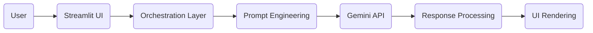

# 🎓 GeminiAi_Career_Advisor_Chatbot
## Production-Ready Domain-Specific Chatbot using Google Gemini API
# 📌 Project Overview
The AI Career Advisor Chatbot is a production-ready, domain-specific conversational AI application built using Google Gemini GenAI API and Streamlit.

The chatbot provides structured and professional career guidance including:

- Career path suggestions
- Skill gap analysis
- Learning roadmaps
- Certification recommendations
- Interview preparation tips
- Industry insights
This project follows clean architecture principles, modular backend design, logging, exception handling, and advanced token optimization.

# 🏗 System Architecture
The application follows a modular architecture:

