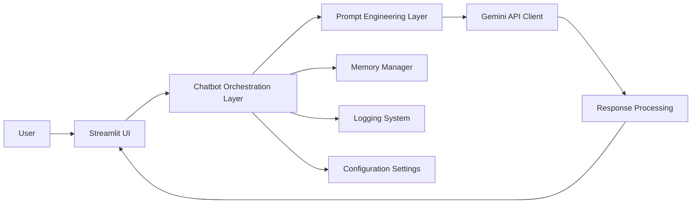

# 🤖 AI Career Advisor Chatbot

A modular, production‑style conversational AI system built using **Streamlit + Google Gemini API**.
The project provides a domain‑restricted **Career Guidance Assistant** with multi‑turn memory, guardrails, logging, and optimized prompt handling.

---

## 🧱 Architecture Overview



---

## 🧩 Architecture Breakdown

### 1️⃣ UI Layer (`app.py`)

* Chat‑style interface
* Session‑based conversation
* Displays conversation history
* Loading indicators
* Avatar support

### 2️⃣ Chatbot Layer (`backend/chatbot.py`)

* Handles user input
* Applies token optimization
* Controls conversation flow
* Calls Gemini client
* Stores conversation history

### 3️⃣ Prompt Engineering Layer (`backend/prompt_manager.py`)

* Defines system prompt
* Implements career‑only guardrails
* Structures contextual prompts

### 4️⃣ Gemini API Layer (`backend/gemini_client.py`)

* Secure API integration
* Configurable generation parameters
* Response validation & cleanup
* Exception handling
* Logging

### 5️⃣ Memory Manager (`backend/memory_manager.py`)

* Multi‑turn conversation memory
* History limiting
* Prevents prompt overflow

### 6️⃣ Logging System (`backend/logger.py`)

* API call logging
* Error logging
* System event tracking
* Persistent log file → `logs/app.log`

### 7️⃣ Configuration (`config/settings.py`)

* Model configuration
* Temperature control
* Output token limits
* No hardcoded secrets

---

## 🚀 Key Features

* Domain‑specific **AI Career Advisor**
* Multi‑turn conversation memory
* Advanced token optimization
* Prompt guardrails (career‑only restriction)
* Response processing layer
* Exception handling
* Logging system
* Modular architecture
* Secure API key handling

---

## 🛠 Tech Stack

* Python
* Streamlit
* Google Gemini GenAI API
* python‑dotenv
* Logging module

---

## ▶️ Running the Project

```bash
# Clone repository
git clone <your_repo_url>
cd <repo_name>

# Create virtual environment
python -m venv venv
source venv/bin/activate  # Windows: venv\Scripts\activate

# Install dependencies
pip install -r requirements.txt

# Add environment variables
create .env file and add:
GEMINI_API_KEY=your_api_key_here

# Run application
streamlit run app.py
```

---

## 📁 Project Structure

```
project/
│── app.py
│── backend/
│   ├── chatbot.py
│   ├── gemini_client.py
│   ├── memory_manager.py
│   ├── prompt_manager.py
│   └── logger.py
│── config/
│   └── settings.py
│── logs/
│   └── app.log
│── requirements.txt
│── README.md
```

---

## 🔐 Security Notes

* API keys are stored using environment variables
* No secrets are hardcoded
* Logging excludes sensitive data

---

## 📌 Future Improvements

* Vector database integration (RAG)
* Resume analysis module
* Interview question generator
* User authentication
* Deployment (Docker / Cloud)

---

## 📄 License

This project is for educational and portfolio use.
